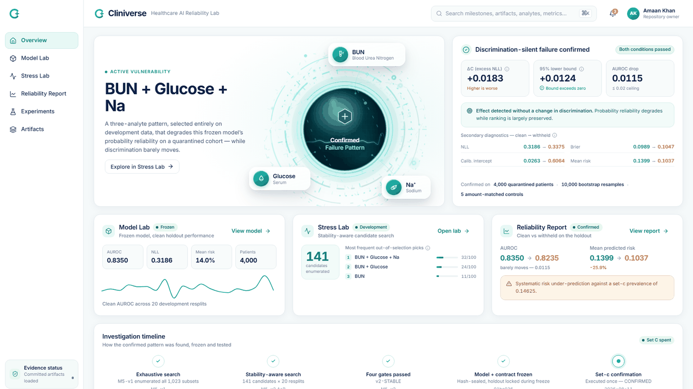
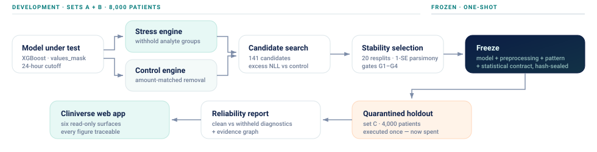
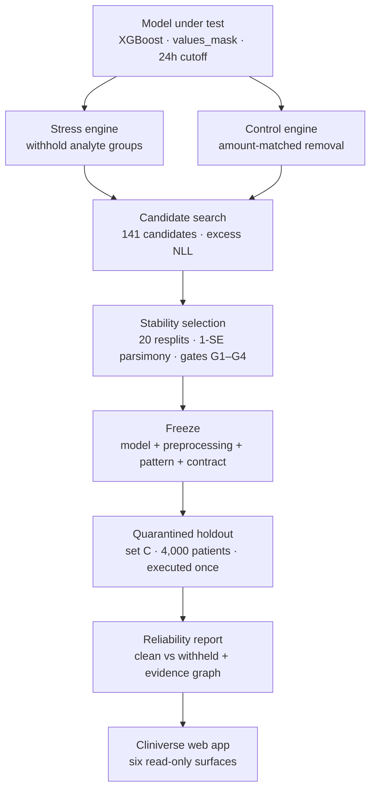
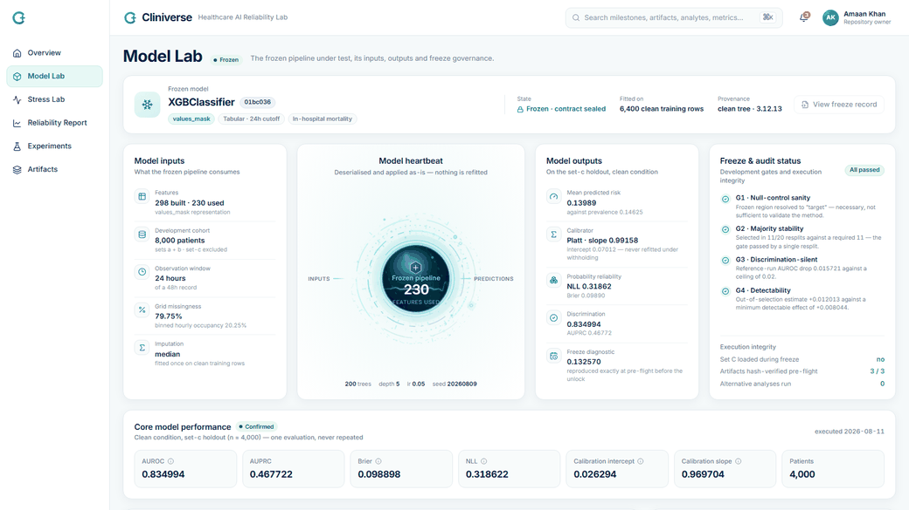
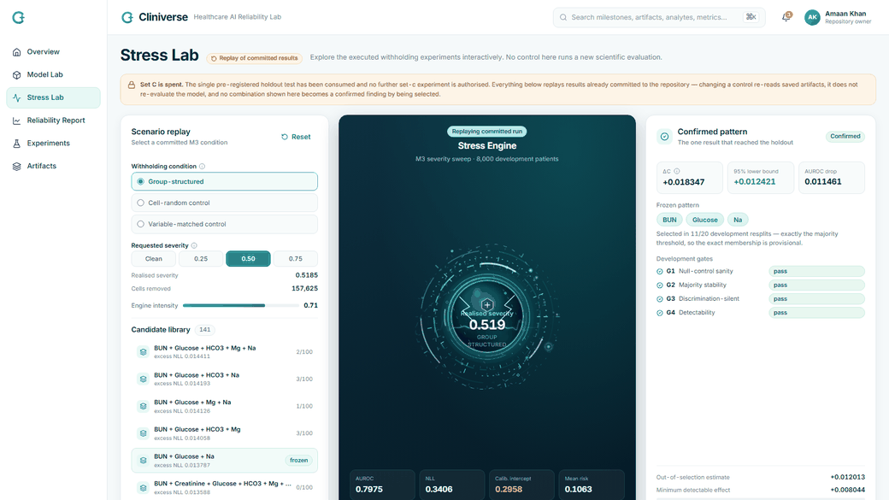
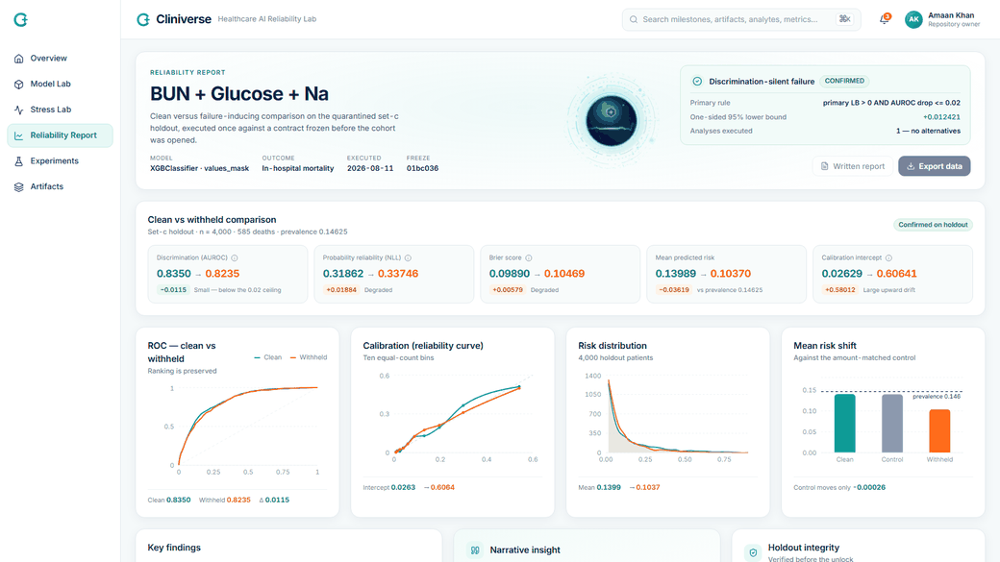
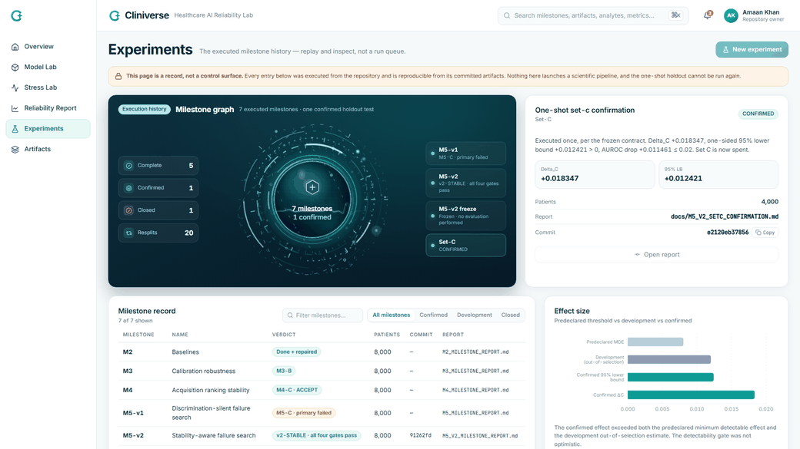
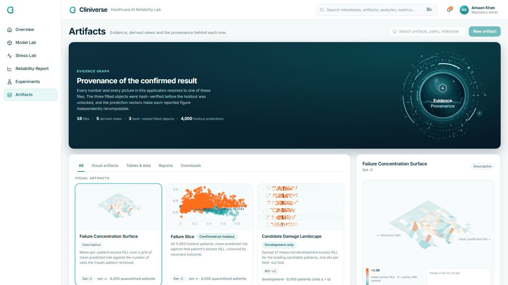

<div align="center">


# Cliniverse

### A pre-deployment crash-test laboratory for healthcare AI

Cliniverse searches for **information dependencies that quietly degrade a model's predicted
probabilities** while its ranking performance stays broadly intact — the kind of failure that a
discrimination-focused evaluation can miss entirely.

<br />



<br />


**Reliability stress testing · Frozen evaluation contract · Auditable provenance**

</div>

<br />

> **Research software.** Not medical advice, not a diagnostic tool, not a treatment recommender.
> All outputs are research and model simulations. See [Limitations](#limitations).

---

##  The problem

A clinical risk model is usually judged on how well it **ranks** patients. AUROC is the habitual
headline, and it answers one question: given a patient who died and a patient who did not, does the
model score them in the right order?

That question is silent about a second one that matters just as much in practice: **is a predicted
risk of 12% actually a 12% risk?**

These two properties can come apart. A model can keep ranking patients sensibly while its predicted
probabilities drift systematically low — because the information environment it was trained in has
shifted underneath it. If evaluation is anchored on discrimination, that drift is close to invisible.

> The model is the car. Cliniverse is the crash-test facility — it damages the information
> environment deliberately, under controlled conditions, and measures what breaks first.

The question Cliniverse asks is narrow and answerable:

**Which information dependencies can measurably damage a model's probability reliability while
leaving its discrimination broadly intact?**

---

##  What Cliniverse is

Cliniverse is a **pre-deployment reliability red-team laboratory** for a healthcare model. It
systematically withholds groups of information from a frozen model, searches for the patterns that
do disproportionate damage, and verifies a single pre-registered candidate on a quarantined holdout.

It performs six things end to end:

| Stage | What happens |
|---|---|
| **Stress** | Withhold co-measurement groups from the model's inputs across a candidate space |
| **Control** | Compare against an *amount-matched* random removal, separating "which analytes" from "how much data" |
| **Search** | Score every candidate by excess probability loss over its control |
| **Stabilise** | Repeat over 20 development resplits and select with 1-SE parsimony, not by taking the maximum |
| **Freeze** | Hash-seal model, preprocessing, calibrator, pattern and the full statistical contract |
| **Confirm** | Execute exactly one pre-registered test on a quarantined holdout, then stop |

**The mortality predictor is the model under test, not the product.** Cliniverse is the instrument
around it.

Cliniverse is **not** a diagnosis engine, a treatment recommender, a clinician chatbot, a bedside
decision tool, an EHR component, or a patient-facing product.

---

##  How the crash test works



The critical design decision is the **amount-matched control**. Removing data always hurts a model
somewhat. The question is whether removing *these particular analytes* hurts more than removing the
*same number of cells at random from the same patients*. Every reported effect is that difference —
written throughout as excess negative log-likelihood, `Delta_C`.

<details>
<summary>Mermaid source for the diagram above</summary>



</details>

---

##  What it found

<div align="center">

### `BUN + Glucose + Na`

**Confirmed on 4,000 quarantined holdout patients — both pre-registered conditions passed**

</div>

<table>
<tr>
<td width="50%" valign="top">

**Primary condition — probability reliability**

| | |
|---|---:|
| Excess NLL over control (`Delta_C`) | **+0.018347** |
| One-sided 95% lower bound | **+0.012421** |
| Decision rule | LB > 0 |
| Result | **PASS** |

</td>
<td width="50%" valign="top">

**Secondary condition — discrimination-silent**

| | |
|---|---:|
| Clean AUROC | **0.834994** |
| Withheld AUROC | **0.823534** |
| AUROC drop | **0.011461** |
| Ceiling fixed before unlock | 0.02 → **PASS** |

</td>
</tr>
</table>

Descriptive diagnostics from the same run, reported for interpretation and **not** part of the
decision rule:

| Diagnostic | Clean | Withheld |
|---|---:|---:|
| Negative log-likelihood | 0.318622 | 0.337461 |
| Brier score | 0.098898 | 0.104690 |
| Calibration intercept | 0.026294 | 0.606415 |
| Calibration slope | 0.969704 | 1.071905 |
| Mean predicted risk | 0.139890 | 0.103699 |

Set-C prevalence is **0.14625**. Under withholding, mean predicted risk falls to 10.4% — the model
becomes systematically **under-confident about risk** while continuing to rank patients much as
before.

> **The ranking still looked reasonable. The probabilities did not.**

That sentence is the finding, and it needs its boundary stated immediately. This is a measured
excess loss under a **synthetic, seeded withholding mechanism** on one retrospective dataset. It is
not evidence of a causal relationship, a biological mechanism, clinical harm, or how often such
information is missing in real care.

---

##  How the result was earned

Cliniverse arrived at one confirmed finding through five prior milestones, each of which changed
what the next was allowed to assume.

| Milestone | Question it asked | Outcome |
|---|---|---|
| **M2** Baselines | Which input representation should be carried forward? | Mask-only reaches AUROC 0.7319 with no clinical values; values dominate (+0.0960 for values over mask, XGBoost). `values_mask` frozen. |
| **M3** Calibration robustness | Does group removal damage calibration more than discrimination? | AUROC 0.8270 → 0.8002 while calibration intercept moves −0.010 → **+0.573**. Verdict M3-B. |
| **M4** Acquisition ranking | Do policy rankings survive cost regimes? | `fixed_domain_order` wins 8/8 conditions, mean Kendall tau-b +0.776. Verdict M4-C. |
| **M5-v1** First search | Can an exhaustive search find a discrimination-silent pattern? | **Primary test failed** (+0.00587, CI crosses zero). Transfer test passed decisively (Spearman +0.865, p = 1.0e-4). Verdict M5-C. |
| **M5-v2** Stability-aware search | Does a stability-corrected search survive its own gates? | 141 candidates × 20 resplits, 1-SE parsimony. All four gates pass. Pattern `BUN+Glucose+Na` frozen. |
| **Freeze** | Can everything be sealed before the holdout opens? | Model, preprocessing, calibrator and a 24-field contract hash-sealed. Set C not loaded. |
| **Set-C** | Does it reproduce, once, on quarantined data? | **CONFIRMED.** Both conditions passed. Set C is now spent. |

M5-v1 is included deliberately. Its primary test **failed**, and that failure is what motivated the
stability-aware redesign in M5-v2. The repository keeps the negative result rather than quietly
replacing it.

### The four development gates

All four had to pass on development data before anything was frozen.

| Gate | Criterion | Observed | State |
|---|---|---|---|
| **G1** Null-control sanity | Frozen region resolves to the target group | region = `target` | Pass |
| **G2** Majority stability | Selected in a majority of resplits | **11 / 20** (required 11) | Pass |
| **G3** Discrimination-silent | Reference-run AUROC drop ≤ 0.02 | 0.015721 | Pass |
| **G4** Detectability | Effect exceeds minimum detectable effect | +0.012013 vs MDE +0.008044 | Pass |

These are internal design gates. They are not a regulatory process, an approval, or a certification
of any kind.

> [!IMPORTANT]
> **Two different stability statistics appear in this project. They must not be conflated.**
>
> **11/20** is the top-level repeated-split statistic behind gate G2 — how many of the 20
> development resplits selected `BUN+Glucose+Na`. The required majority was exactly 11, so the gate
> passed **by a single resplit**. The precise three-analyte membership is therefore knife-edge; the
> broader **BUN-centred family is more stable** than this exact set.
>
> **32/100** is a different quantity entirely: how many of the 20 resplits × 5 held-out folds = 100
> *nested out-of-selection* picks landed on the same pattern. It is not the G2 statistic and must
> never be presented as one.

---

##  Dataset and task

| | |
|---|---|
| **Dataset** | PhysioNet / Computing in Cardiology Challenge 2012 |
| **Licence** | Open Data Commons Attribution License v1.0 — no credentialing required |
| **Scale** | 12,000 labelled patients; 37 irregularly-sampled time-series variables over 48 hours |
| **Sparsity** | 79.75% missing on the binned hourly grid (20.25% occupancy) |
| **Development** | Sets A + B — 8,000 patients, split 6,400 model-training / 1,600 calibration |
| **Holdout** | Set C — 4,000 patients, 585 in-hospital deaths, prevalence 0.14625 |
| **Task** | In-hospital mortality from information available through a **24-hour cutoff** |
| **Representation** | `values_mask` — imputed values plus explicit missingness indicators |

This is a **retrospective** evaluation on a historical ICU cohort. Nothing here is prospective, and
nothing here is deployment validation. Verify dataset access and reproduce the structural statistics
with `python scripts/verify_physionet2012.py`.

### Set-C handling — stated precisely

Set C is a quarantined holdout that has now been **used once and is spent**. The repository is
specific about what that means, and the wording matters:

> **No Set-C patient-level information was retained or used for model fitting, model selection,
> failure-pattern selection, or any M5-v2 statistic after the aggregate audit.**

The final evaluation is therefore best described as **a quarantined patient-level holdout evaluation
after prior aggregate cohort-level exposure** — not as a cohort that was never touched. Set C was
**not loaded during model freeze** (`loaded_during_freeze: false`, `scored_during_freeze: false`).

The one-shot test has been consumed. **No further Set-C experiment is authorised by this result**,
and this repository deliberately provides no command to repeat it.

---

##  Model under test

<table>
<tr><td valign="top" width="52%">

| Property | Value |
|---|---|
| Estimator | `XGBClassifier` |
| Representation | `values_mask` |
| Observation window | 24-hour cutoff |
| Features built | 298 |
| Split features used | 230 |
| Imputation | median, fitted once on clean training rows |
| Fitted on | 6,400 clean final-training rows |
| Random state | 20260809 |

</td><td valign="top" width="48%">

```text
n_estimators       200
max_depth            5
learning_rate     0.05
min_child_weight    10
subsample          0.8
colsample_bytree   0.8
reg_lambda         1.0
tree_method       hist
```

**Frozen Platt calibrator** — fitted on the 1,600 clean
calibration rows and never refitted under withholding:

```text
slope       0.9915814346171334
intercept   0.07011626064263363
```

</td></tr>
</table>

The calibrator parameters above are the **frozen** ones. They are a different quantity from the
Set-C calibration *diagnostics* reported earlier (intercept 0.026294 clean, 0.606415 withheld),
which describe the model's behaviour on the holdout rather than the fitted calibration map.

---

##  The laboratory

Six surfaces, each answering a different question. Every figure resolves to a committed artifact.

<table>
<tr>
<td width="50%"></td>
<td width="50%"></td>
</tr>
<tr>
<td><b>Model Lab</b><br/><sub>The frozen pipeline: inputs, outputs, hash-sealed artifacts and audit state.</sub></td>
<td><b>Stress Lab</b><br/><sub>Interactive <b>replay</b> of committed experiments. Controls re-read saved artifacts; they do not re-evaluate the model.</sub></td>
</tr>
<tr>
<td></td>
<td></td>
</tr>
<tr>
<td><b>Reliability Report</b><br/><sub>Clean vs withheld comparison, ROC, calibration curve, risk distribution and mean-risk shift.</sub></td>
<td><b>Experiments</b><br/><sub>Executed milestone history and reproducibility record — a log, not a run queue.</sub></td>
</tr>
</table>



**Artifacts** — the evidence library: committed files with SHA-256 provenance, alongside derived
visualisations computed from the saved prediction vectors.

Where an action is genuinely unavailable, the control is disabled and explains why. There is no
button in this application that pretends to run a scientific pipeline.

---

##  Evidence and provenance

Every visualisation is derived from a committed artifact by `scripts/export_ui_data.py`. The web
application performs **no** scientific computation of its own.

| Visual artifact | Derived from | What it is — and is not |
|---|---|---|
| **Failure Concentration Surface** | Set-C predictions binned by clean predicted risk × removed-cell count, plotting mean `d_i` | A descriptive stress-test surface. Both axes are experiment artefacts. **Not** a biological feature-response surface. |
| **Failure Slice** | All 4,000 Set-C patients: clean risk vs per-patient `d_i`, coloured by recorded outcome | Real per-patient values. The decision rule was evaluated on the mean and its bound, not on individuals. |
| **Candidate Damage Landscape** | 141 candidates × 20 resplits × 5 folds of development excess NLL | A distribution of measured loss differences. **Not SHAP, not feature importance, not attribution** — no such method exists in this project. |
| **Withholding Burden Profile** | Removed-cell counts per patient | mean 5.94225 · median 6 · p10 3 · p90 10. Removal is clipped to observed availability; 94 patients had no eligible cells. |
| **Case Explorer** | Saved record ids, outcomes and clean/withheld predictions | Exactly the columns the artifact stores. **No clinical covariates**, because the artifact holds none. |

The exporter derives ROC curves, reliability bins, risk histograms, mean-risk shifts, the M3 severity
sweep, the M2 representation grid, candidate distributions and per-patient prediction rows — all from
committed `.json` and `.npz` files. It refuses to emit a bundle whose frozen calibrator reads as
zero, and it is **deterministic**: repeated runs produce a byte-identical bundle.

---

##  Technology

| Layer | Stack |
|---|---|
| **Modelling** | Python 3.12 · NumPy · pandas · scikit-learn · XGBoost |
| **Evaluation** | Paired patient-level percentile bootstrap (10,000 replicates, seed 20260809) · amount-matched controls · 1-SE parsimony selection |
| **Frontend** | React 18.3 · TypeScript 5.7 · Vite 6.4 · Tailwind CSS 4.3 · Framer Motion 11 · Recharts 3.10 · React Router 6.30 · Lucide |
| **Quality** | pytest · Ruff · ESLint · TypeScript strict |

### The Cliniverse Orb

The product's signature visualisation is a native **React + SVG + CSS + Framer Motion** component —
no raster image, no WebGL, no Three.js. It carries deterministic seeded geometry so nothing reshuffles
between renders: seven concentric technical bands (several drawn as partial arcs), four elliptical
orbital planes split across front and rear render layers so the glass core genuinely occludes what
passes behind it, 22 tiered orbital nodes, 104 radial graduations, 36 atmospheric particles, and a
continuously travelling telemetry waveform built from cubic Bézier segments.

Interaction is **localised**: the core, each band and each analyte chip own their own hit target and
respond independently, so moving the pointer never disturbs the whole system. Reduced-motion
preferences stand the motion down while preserving every layer.

---

##  Project structure

```text
ClinicVerse/
├── cliniverse/              # scientific package
│   ├── data/                # PhysioNet parser, cohort assembly, split guards
│   ├── encoders/            # feature summarisation
│   ├── evaluation/          # metrics, calibration, information loss, failure search
│   └── acquisition/         # policies, simulation, evaluator
├── twinbench/               # benchmark case generation and disclosure protocols
├── experiments/             # executed runs and their committed results
│   ├── baselines/results/   # M2
│   ├── robustness/results/  # M3, M5, M5-v2, freeze, Set-C
│   └── acquisition/results/ # M4
├── configs/                 # variable and co-measurement catalogues
├── docs/                    # design records, milestone reports, limitations
├── scripts/                 # dataset verification, UI data exporter
├── tests/                   # scientific regression suite
└── web/                     # React reliability laboratory
```

---

##  Running it

### Scientific package

```bash
uv sync --extra models --extra api
```

```bash
uv run pytest -q -m "not slow"
```

```bash
python scripts/verify_physionet2012.py
```

### Frontend

The web application reads a committed data bundle, so it runs without the dataset present.

```bash
python scripts/export_ui_data.py
```

```bash
npm --prefix web install && npm --prefix web run dev
```

Then open `http://localhost:5173`. Production build:

```bash
npm --prefix web run build
```

> [!WARNING]
> **Do not attempt to re-run the Set-C confirmation.**
>
> The one-shot holdout test was executed once under a frozen, pre-registered contract and Set C is
> now spent. Re-running it would not be a replication — it would be a second look at a holdout that
> is only valid when looked at once. `load_cohort()` defaults to sets A + B and requires an explicit
> unlock token for set C, and this is intentional.
>
> **Safe and reproducible:** development analyses, the test suite, loading frozen artifacts,
> regenerating the UI bundle, replaying committed results in the application.
> **Not authorised:** repeating the Set-C scientific confirmation.

---

##  Verified quality gates

Observed on this repository at the time of writing:

| Gate | Command | Result |
|---|---|---|
| Full test suite | `python -m pytest` | **436 passed** |
| CI gate | `python -m pytest -m "not slow"` | **409 passed, 27 deselected** |
| Frontend types | `tsc -b --noEmit` | pass |
| Frontend lint | `eslint . --max-warnings 0` | pass |
| Frontend build | `vite build` | pass |
| Exporter lint | `ruff check` · `ruff format --check` | pass |
| Bundle determinism | `export_ui_data.py` × 3 | byte-identical |

The repository's CI also runs `mypy` and `uv sync`; those two have **not** been independently
verified in the environment these figures were produced in, and are listed here without a claimed
result.

Reproducibility is enforced structurally rather than by convention: every result artifact carries the
git SHA, platform, Python and package versions, cohort fingerprint, split hashes and configuration
hash under which it was produced. The frozen model, calibrator and imputer are hash-verified before
use, and the run aborts on any mismatch.

---

##  Limitations

These constrain the result and were written to be read alongside it, not buried beneath it.

- **Retrospective, single dataset, single task.** One historical ICU cohort, one cutoff, one outcome.
  There is no external validation beyond this holdout.
- **Synthetic withholding, not observed missingness.** The stress mechanism is specified, seeded and
  disclosed by this project. It is not a measurement of how often information is actually missing in
  care, and results do not transfer to that claim.
- **Groups are reconstructed, not verified orders.** Co-measurement clusters (`*_like`) are derived
  from the data. They are **not** confirmed laboratory order panels.
- **The exact membership is knife-edge.** `BUN+Glucose+Na` passed gate G2 at exactly the majority
  threshold, 11/20. Confirmation does not establish that these three analytes are the uniquely
  correct minimal set — the **BUN-centred family is better supported than the exact membership**.
- **Whole-window removal.** The mechanism removes an analyte across the whole window, so it cannot
  test co-occurrence structure or ordering effects.
- **Bootstrap scope.** The five control draws are fixed across all 10,000 replicates. The interval
  propagates patient-sampling uncertainty but **not** control-draw Monte-Carlo uncertainty, and is
  mildly optimistic on that account.
- **No causal claim.** Nothing here identifies a causal relationship, a biological mechanism, or a
  clinical consequence.
- **No clinical or deployment validation.** No prospective evaluation, no clinician review, no
  regulatory standing, no evidence of patient benefit or harm.
- **No generality claim.** This vulnerability was found in one frozen model. Nothing establishes that
  it appears in other healthcare models.

An honest disclosure the repository keeps rather than hides: the Set-C result artifact records
`git_dirty: true`. The only uncommitted item was the runner script, which was untracked when it ran;
the three frozen artifacts were hash-verified before use. This will not be repaired by re-running,
because re-running would mean a second look at the holdout.

---

##  Responsible use

Cliniverse is intended for **model development, pre-deployment evaluation, reliability research and
governance inspection**.

It is not intended for diagnosis, treatment, triage, or bedside decision-making, and it produces no
output suitable for those purposes. The mortality model inside it exists to be stress-tested, not to
be used.

---

##  Why this matters

The contribution is **not** that `BUN + Glucose + Na` is clinically important. It is not, and this
project makes no such claim.

The contribution is methodological:

> A healthcare model can preserve its ranking behaviour while its probability behaviour silently
> deteriorates — and a structured, controlled, pre-registered stress test can expose that before
> deployment rather than after.

An evaluation that reports AUROC and stops would have recorded a drop of 0.0115 here and called the
model stable. The same run shows mean predicted risk falling from 0.1399 to 0.1037 against a
prevalence of 0.14625. Both statements describe the same model on the same patients. Only one of
them would have reached a reviewer.

---

##  Roadmap

Realistic extensions, in rough order of value:

- Additional model families under the same harness — logistic, gradient-boosted and neural baselines
- Additional prediction tasks beyond in-hospital mortality
- A richer stress library covering temporal and subgroup shifts alongside group withholding
- Model-comparison mode: which of two candidate models is more reliability-fragile
- Uncertainty-aware candidate selection to reduce the resplit-count burden
- External datasets, to test whether the method transfers even when the finding does not
- Prospective validation of the withholding assumptions themselves

---

##  Data, citation and licence

**Dataset.** PhysioNet / Computing in Cardiology Challenge 2012, used under the
**Open Data Commons Attribution License v1.0**. No credentialed or identifiable patient data is used
or committed to this repository. Attribution to PhysioNet/CinC is required for any downstream use of
the data; please cite the original challenge alongside this work.

**Prior art.** Group-level acquisition with shared cost is **not** novel here — see
[Yu et al., ICLR 2023](https://arxiv.org/abs/2302.10261), the closest prior art. This project adopts
that setting rather than claiming it. The contribution is a measurement one.

---

##  Where to read next

| Document | Contents |
|---|---|
| [`docs/M5_V2_SETC_CONFIRMATION.md`](docs/M5_V2_SETC_CONFIRMATION.md) | The confirmed result, its mandatory limitation wording and the execution-integrity record |
| [`docs/M5_V2_FINAL_FREEZE.md`](docs/M5_V2_FINAL_FREEZE.md) | The freeze package and the 24-field evaluation contract |
| [`docs/LIMITATIONS.md`](docs/LIMITATIONS.md) | Written before results existed — read before citing anything |
| [`docs/STATUS.md`](docs/STATUS.md) | Milestone state and verified facts |
| [`docs/EXPERIMENTS.md`](docs/EXPERIMENTS.md) | Executed runs only. No projected numbers. |
| [`docs/BENCHMARK_SPEC.md`](docs/BENCHMARK_SPEC.md) | Formal estimand and information boundary |

<div align="center">
<br />
<sub><b>Cliniverse</b> · Healthcare AI Reliability Lab · Research software, not a medical device</sub>
</div>
